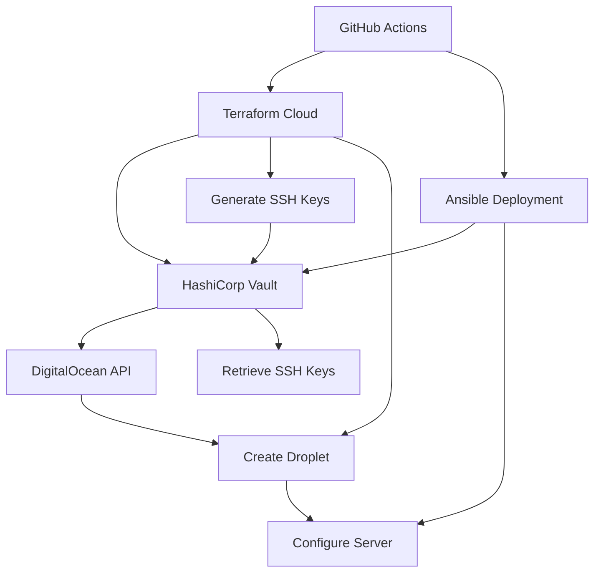

# 🚀 Zero-Touch Infrastructure Deployment

**Fully Automated Server Provisioning and Configuration Pipeline**

This project demonstrates a complete infrastructure-as-code solution that provisions and configures servers from scratch without ever needing to manually log into a server. It showcases modern DevOps practices using Terraform, HashiCorp Vault, Ansible, and GitHub Actions.

## 🎯 Project Goals

- **Zero Manual Intervention**: Deploy complete infrastructure and applications without logging into servers
- **Security First**: All credentials and secrets managed through HashiCorp Vault
- **Reproducible Deployments**: Environment can be recreated countless times consistently
- **Temporary Access**: Dynamic SSH keys and temporary tokens for enhanced security
- **Full Automation**: From server creation to application deployment via GitHub Actions

## 🏗️ Architecture Overview



## 🔧 Technology Stack

- **🏗️ Infrastructure**: Terraform with Terraform Cloud
- **🔐 Secret Management**: HashiCorp Vault
- **☁️ Cloud Provider**: DigitalOcean
- **⚙️ Configuration Management**: Ansible
- **🔄 CI/CD**: GitHub Actions
- **📋 Inventory Management**: Dynamic inventory with Vault integration

## 📁 Project Structure

```
ansible-connection/
├── 📂 terraform/staging/          # Infrastructure as Code
│   ├── main.tf                   # Primary Terraform configuration
│   └── variable.tf               # Variable definitions
├── 📂 .github/workflows/         # CI/CD Pipelines
│   ├── terraform-deploy.yml      # Terraform deployment workflow
│   ├── ansible-vault-deploy.yml  # Ansible configuration workflow
│   └── infra-deploy.yml          # Combined infrastructure pipeline
├── 📂 inventory/                 # Dynamic inventory management
│   ├── digitalocean.yml          # DigitalOcean inventory plugin
│   └── generate_inventory.py     # Custom inventory generator
├── 📂 playbooks/                 # Ansible configuration
│   └── test.yml                  # Server configuration playbook
├── 📂 pub_keys/                  # Static SSH keys (if needed)
├── ansible.cfg                   # Ansible configuration
├── requirements.yml              # Ansible collection dependencies
└── requirements.txt              # Python dependencies
```

## 🔐 Security Architecture

### HashiCorp Vault Integration

The project uses HashiCorp Vault as the central secret management system:

#### **Vault Setup Requirements:**
1. **DigitalOcean Token Storage**:
   ```bash
   vault kv put token/digitalocean token="your_digitalocean_token"
   ```

2. **Environment Variables**:
   - `VAULT_ADDR`: HashiCorp Vault server address
   - `VAULT_TOKEN`: Vault authentication token

#### **Dynamic Secret Flow:**
1. **Terraform** generates RSA key pairs and stores them in Vault
2. **AppRole Authentication** creates temporary tokens for GitHub Actions
3. **Dynamic SSH Access** retrieves keys at runtime for server configuration
4. **Automatic Cleanup** removes temporary credentials after deployment

### Terraform Vault Integration

```hcl
# Generate dynamic SSH keys
resource "tls_private_key" "ssh" {
  algorithm = "RSA"
  rsa_bits  = 4096
}

# Store keys in Vault
resource "vault_generic_secret" "ssh_keypair" {
    path = "secret/ssh-keys"
    data_json = jsonencode({
        public_key  = tls_private_key.ssh.public_key_openssh
        private_key = tls_private_key.ssh.private_key_pem
    })
}

# Create temporary GitHub Actions access
resource "vault_approle_auth_backend_role" "github_actions" {
    role_name      = "github-actions"
    token_policies = [vault_policy.github_actions_policy.name]
    token_ttl      = 600    # 10 minutes
    token_max_ttl  = 1200   # 20 minutes
}
```

## ⚙️ Setup Instructions

### 1. 🏗️ Terraform Cloud Configuration

1. **Create Terraform Cloud Account** at [app.terraform.io](https://app.terraform.io)
2. **Create Organization**: `gcp-live`
3. **Create Workspace**: `ansible-connection-staging`
4. **Configure Variables**:
   - `VAULT_ADDR`: Your HashiCorp Vault server URL
   - `VAULT_TOKEN`: Vault authentication token
   - `DIGITALOCEAN_TOKEN`: DigitalOcean API token (stored in Vault)

### 2. 🔐 HashiCorp Vault Setup

```bash
# Store DigitalOcean token in Vault
vault kv put token/digitalocean token="dop_v1_your_token_here"

# Verify storage
vault kv get token/digitalocean
```

### 3. 🔑 GitHub Secrets Configuration

Add these secrets to your GitHub repository:

| Secret Name | Description | Required |
|-------------|-------------|----------|
| `TF_API_TOKEN` | Terraform Cloud API token | ✅ |
| `VAULT_ADDR` | HashiCorp Vault server address | ✅ |
| `VAULT_TOKEN` | Vault authentication token | ✅ |

### 4. 📦 Dependencies Installation

```bash
# Install Ansible collections
ansible-galaxy collection install -r requirements.yml

# Install Python dependencies
pip install -r requirements.txt
```

## 🚀 Deployment Workflows

### Manual Deployment

Navigate to **Actions** → **Full Infrastructure Deploy** → **Run workflow**

**Options:**
- **Environment**: `staging` or `production`
- **Terraform Action**: `plan`, `apply`, or `destroy`

### Automatic Deployment

- **Push to `main`**: Triggers production deployment
- **Push to `develop`**: Triggers staging deployment

## 🔄 Deployment Process Flow

### Phase 1: Infrastructure Provisioning (Terraform)
1. **Authentication** with Terraform Cloud using `TF_API_TOKEN`
2. **Vault Integration** retrieves DigitalOcean token from Vault
3. **SSH Key Generation** creates RSA 4096-bit key pair
4. **Key Storage** saves keys securely in Vault KV store
5. **Droplet Creation** provisions DigitalOcean server with generated SSH key
6. **AppRole Setup** creates temporary GitHub Actions access credentials

### Phase 2: Configuration Management (Ansible)
1. **AppRole Authentication** gets temporary Vault token
2. **SSH Key Retrieval** downloads private key from Vault
3. **Dynamic Inventory** discovers servers using DigitalOcean plugin
4. **Server Configuration** runs Ansible playbooks for setup
5. **Cleanup** removes temporary keys and tokens

## 📋 Inventory Management

### Dynamic DigitalOcean Inventory

The project uses a sophisticated inventory system that automatically discovers servers:

```yaml
# inventory/digitalocean.yml
plugin: community.digitalocean.digitalocean
api_token: "{{ lookup('community.hashi_vault.vault_kv2_get', 'digitalocean', engine_mount_point='token').secret.token }}"
compose:
  ansible_host: do_networks.v4 | selectattr('type','eq','public') | map(attribute='ip_address') | first
  ansible_user: root
keyed_groups:
  - key: do_tags | lower
    prefix: ""
    separator: ""
```

### Features:
- **Vault Integration**: API token retrieved securely from Vault
- **Automatic Discovery**: Finds all active DigitalOcean droplets
- **Tag-based Grouping**: Organizes servers by tags
- **Dynamic Host Variables**: Automatically sets connection details

## 🎮 Usage Examples

### Deploy New Environment
```bash
# Via GitHub Actions UI
1. Go to Actions → "Full Infrastructure Deploy"
2. Select environment: staging
3. Select action: apply
4. Click "Run workflow"
```

### Destroy Environment
```bash
# Via GitHub Actions UI
1. Go to Actions → "Full Infrastructure Deploy"  
2. Select environment: staging
3. Select action: destroy
4. Click "Run workflow"
```

### Local Development
```bash
# Test inventory
export VAULT_ADDR="https://vault.devops-ottawa.com"
export VAULT_TOKEN="your_vault_token"
ansible-inventory --list

# Test connectivity
ansible all -m ping

# Run playbooks
ansible-playbook playbooks/test.yml
```

## 🛡️ Security Features

### ✅ **Zero Persistent Credentials**
- SSH keys generated dynamically per deployment
- Temporary Vault tokens with short TTL (10-20 minutes)
- No hardcoded secrets in code or CI/CD

### ✅ **Least Privilege Access**
- GitHub Actions receives minimal required permissions
- Vault policies restrict access to specific paths only
- AppRole authentication with time-limited tokens

### ✅ **Audit Trail**
- All Vault access logged and auditable
- GitHub Actions provides deployment history
- Terraform state tracked in Terraform Cloud

### ✅ **Automatic Cleanup**
- SSH keys removed from filesystem after use
- Vault tokens automatically expire
- Environment variables cleared post-deployment

## 📊 Monitoring and Troubleshooting

### Common Issues

**Vault Authentication Failure:**
```bash
# Check Vault connectivity
curl -H "X-Vault-Token: $VAULT_TOKEN" $VAULT_ADDR/v1/sys/health

# Verify token permissions
vault auth -method=token $VAULT_TOKEN
vault token lookup
```

**DigitalOcean API Issues:**
```bash
# Test DigitalOcean token
curl -X GET \
  -H "Authorization: Bearer $DO_TOKEN" \
  "https://api.digitalocean.com/v2/account"
```

**Ansible Connectivity:**
```bash
# Test SSH connectivity
ansible all -m ping -vvv

# Check inventory
ansible-inventory --graph
```

## 🔄 Workflow Customization

### Adding New Environments

1. **Create Terraform directory**: `terraform/production/`
2. **Update workflows**: Add environment to choice lists
3. **Configure Vault policies**: Add environment-specific access
4. **Test deployment**: Run with new environment

### Custom Playbooks

1. **Add playbook**: Create in `playbooks/` directory
2. **Update workflow**: Add to playbook choice list
3. **Test locally**: Run `ansible-playbook playbooks/your-playbook.yml`

## 📈 Benefits Achieved

### 🎯 **For Operations Teams**
- **Zero Manual SSH Access**: No need to manage individual SSH keys
- **Consistent Deployments**: Every environment built identically
- **Rapid Recovery**: Recreate entire infrastructure in minutes
- **Security Compliance**: Centralized secret management with audit trails

### 🎯 **For Development Teams**  
- **Self-Service Deployment**: Developers can deploy without operations
- **Environment Parity**: Development matches production exactly
- **Fast Iteration**: Quick environment spin-up for testing
- **No Secret Management**: Vault handles all credential complexity

### 🎯 **For Security Teams**
- **No Persistent Access**: All access is temporary and audited
- **Centralized Secrets**: Single source of truth in Vault
- **Automatic Rotation**: SSH keys rotate with each deployment
- **Compliance Ready**: Full audit trail of all access

## 🚀 Future Enhancements

- [ ] **Multi-Cloud Support**: Extend to AWS, GCP, Azure
- [ ] **Application Deployment**: Automated application deployment pipelines  
- [ ] **Monitoring Integration**: Prometheus/Grafana deployment
- [ ] **Backup Automation**: Automated backup and restore procedures
- [ ] **Blue/Green Deployments**: Zero-downtime deployment strategies
- [ ] **Auto-Scaling**: Dynamic server scaling based on load

---

## 📞 Support

For questions or issues:
1. Check the **Issues** tab for known problems
2. Review **GitHub Actions logs** for deployment details  
3. Verify **Vault connectivity** and permissions
4. Test **Terraform configuration** locally

**🎉 This project demonstrates the power of modern DevOps practices - infrastructure that deploys itself securely and consistently, every single time!**